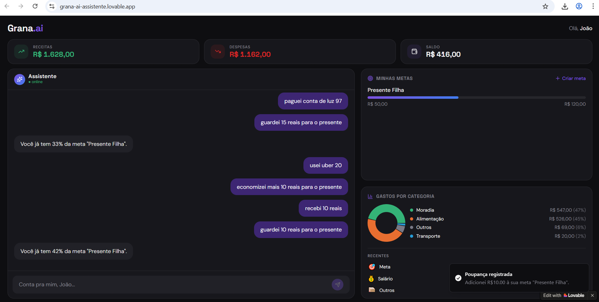

# 💸 Grana.ai

## 🧭 Por que esse projeto existe?

Como parte do DESAFIO de Projeto no BOOTCAMP LUPO na [DIO](https://www.dio.me/), precisei desenvolver um APP de Organização de Finanças Pessoais com Vibe Coding.

Na verdade, eu sempre tive a sensação de que organizar a vida financeira não deveria ser tão complicado.

Mesmo com tantos apps disponíveis, a maioria exige esforço demais, organização manual e, no fim, não ajuda a entender o que realmente está acontecendo com o dinheiro.

O Grana.ai nasce dessa inquietação: tornar o controle financeiro algo simples, natural e presente no dia a dia.

---

## 💡 O que é o Grana.ai?

O Grana.ai é um aplicativo de finanças pessoais que combina duas formas de interação:

- 💬 uma conversa simples, quase como falar com alguém  
- 📊 uma visão clara da sua “carteira”  

A ideia é permitir que você registre, entenda e tome decisões financeiras sem precisar pensar em planilhas ou sistemas complexos.

---

## ⚙️ Como funciona na prática

Você pode usar o app de forma natural, como faria em uma conversa:

- "Gastei 30 no almoço"  
- "Assinei Netflix por 39,90"  
- "Guardei 100 para viagem"  

A partir disso, o sistema organiza tudo automaticamente.

Ele entende o tipo de transação, classifica a categoria e atualiza o que for necessário, incluindo metas.

---

## 🎯 O que esse projeto resolve

Mais do que registrar gastos, o Grana.ai busca resolver alguns problemas comuns:

- dificuldade em manter consistência no controle financeiro  
- falta de clareza sobre para onde o dinheiro está indo  
- subestimação de pequenos gastos recorrentes  
- ausência de orientação prática no momento certo  

A proposta aqui é reduzir fricção e aumentar consciência.

---

## ✨ Principais funcionalidades

- 🧾 registro de gastos usando linguagem natural  
- 🏷️ categorização automática (incluindo streaming e compras online)  
- 🎯 metas financeiras com acompanhamento de progresso  
- 💰 contribuição para metas direto pela conversa  
- 📈 sugestão automática de poupança baseada na sobra do mês  
- 📊 dashboard com gráfico e legenda  
- 🔔 notificações leves para confirmação de ações  
- 🧠 insights baseados em comportamento  

---

## 🧩 Estrutura do app

A experiência foi pensada como uma “carteira pessoal digital”.

### 🟣 Início

- receitas, despesas e saldo  
- resumo das metas  
- mini dashboard  

### 💬 Chat

- registrar gastos  
- tirar dúvidas  
- receber insights  

### 🎯 Metas

- progresso visual  
- histórico  
- atualização automática  

---

## 🎨 Design

- 🌙 tema escuro  
- 🟣 cores em roxo e azul  
- 🧼 interface limpa  
- 🎯 foco na clareza  

A intenção nunca foi impressionar pelo excesso, mas pela simplicidade.

---

## 🛠️ Tecnologias e ferramentas
 
- 🎨 Lovable
- 🧠 Copilot / ChatGPT
- 🧩 UX/UI Design  
- ⚙️ lógica baseada em regras  

---

## 🔄 Reflexão sobre o processo

### ✅ O que funcionou bem

A combinação entre conversa e visualização trouxe equilíbrio.

O app deixou de ser apenas um registrador de gastos e passou a ajudar na leitura da própria vida financeira.

A criação da “carteira” como tela principal melhorou muito a experiência.

Separar confirmações (notificações) e insights (chat) deixou tudo mais fluido.

---

### ⚠️ O que não saiu como esperado no início

A primeira versão ficou muito dependente do chat.

As respostas eram repetitivas, a categorização inconsistente e faltava integração entre funcionalidades como metas e contribuições.

Isso mostrou que só descrever funcionalidades não era suficiente.

Foi necessário definir regras claras de comportamento.

---

### 🧠 O que aprendi nesse processo

A qualidade do resultado depende diretamente da clareza das instruções.

Aprendi que:

- regras específicas melhoram muito o resultado  
- pequenos detalhes impactam diretamente a experiência  
- iterar faz parte do processo  

Construir com IA exigiu pensar como produto, não apenas como execução.

---

## 📄 PRD — Product Requirements Document

Como parte do desenvolvimento, foi estruturado um PRD para organizar a lógica, o comportamento e a experiência do produto.

---

### 🧭 Contexto

O Grana.ai combina conversa e visualização para simplificar o controle financeiro.

---

### 🎯 Problema

- dificuldade em manter controle financeiro  
- falta de clareza sobre gastos  
- insights pouco úteis  

---

### 👥 Público-alvo

- iniciantes em finanças  
- usuários que buscam simplicidade  
- pessoas sem conhecimento técnico  

---

### 💡 Proposta de valor

- registrar gastos facilmente  
- organizar automaticamente  
- gerar insights relevantes  
- integrar metas ao dia a dia  

---

### 🧩 Estrutura

- onboarding  
- carteira (home)  
- chat  
- metas  

---

### 💬 Comportamento

- confirmações → notificações  
- insights → chat  

---

### 🏷️ Categorias

- Alimentação  
- Transporte  
- Moradia  
- Lazer  
- Saúde  
- Educação  
- Assinaturas  
- Streaming  
- Compras Online  
- Outros  

---

### 🎯 Metas

Reconhece contribuições via linguagem natural e atualiza progresso automaticamente.

---

### 💰 Sugestão de poupança

- margem: 10%  
- sugestão: 30% da sobra  

---

### 🧠 Insights

Baseados em comportamento, não apenas em dados.

---

### 🎨 Design

- tema escuro  
- visual limpo  
- alto contraste  

---

### ⚙️ Restrições

- sem integrações externas  
- sem autenticação real  
- lógica simples (MVP)  

---

### 📦 Entregáveis

- onboarding  
- carteira estruturada  
- chat funcional  
- dashboard com legenda  
- metas com progresso  
- contribuição para metas  
- sugestão de poupança  
- insights relevantes  

---

## 📸 Preview

---

## 🔗 Acesso ao projeto

👉 https://grana-ai-assistente.lovable.app

---

## 👩‍💻 Sobre mim

Projeto desenvolvido por Danieli Dutra como parte de um DESAFIO do Bootcamp LUPO na [DIO](https://www.dio.me/).
